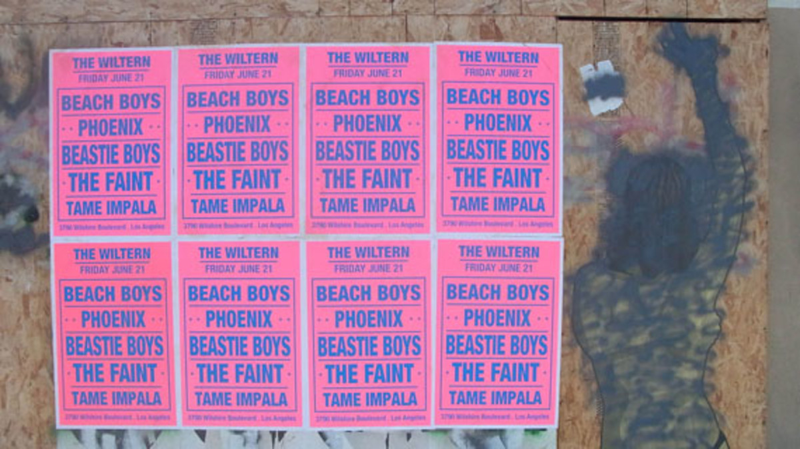
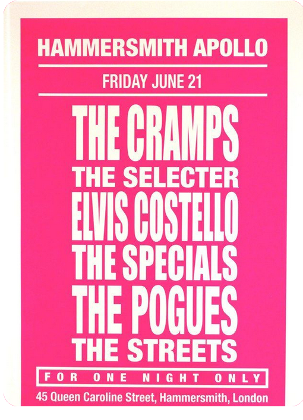
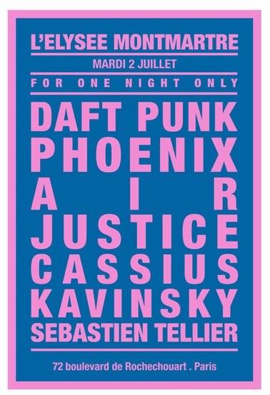

# SHORT ANSWER QUESTIONS

When do we use the pushMatrix() and popMatrix()?

When do we use an array?

What are Classes and Objects used for?

Why might we use the built-in keyPressed boolean variable instead of using the built-in keyPressed function? 

What are && and || used for?

What is a finite state machine used for?

Why does Processing have additional libraries (such as Sound and Video) separate from the main Processing program?

Extra Credit Question 1: Why do color values in Processing range from 0 to 255?

Extra Credit Question 2: Why might you write this somewhere in your software: myVariable = !myVariable;

## HISTORY AND TECHNIQUE QUESTIONS

Briefly describe your strategy for debugging code.

Briefly explain how the Jacquard Loom is related to modern computing.

Briefly describe at least one of Grace Hopper's innovations in the field of computing and software design.

# CODE

Note: Please upload your progress even if you don't solve all aspects of each coding challenge. You may gain partial credit.

A>  
In the past decade the french street artist Andre Saraiva (also knows as "Monsieur A") has been putting up fake concert posters for his favorite bands and DJs in cities around the world. These posters feature large all-cap listings of unlikely combinations of performers at his favorite venues, sometimes even after the bands have broken up or the concert venue has closed down. After several years of making these posters, he started making fake posters for exhibits, collaborations between chefs, authors, and graffiti writers. Your assignment: create your own dream concert poster (or favorite authors for a book festival, or filmamkers for a film festival, games in a games exhibit, etc). Use a custom font from DaFont.com. In your project you should place a venue name at the top (such as a concert hall or library), then a stack of performers (or whatever your topic is). The text should be one color. The background should be a contrasting color. I suggest making the dimensions of your poster 500 wide by 800 high. You will have to import a font and set text sizes.

If you're not sure what font to use, browse and select one from the [Basic San-Serif](https://www.dafont.com/theme.php?cat=501) section. You will need to use a large font font size, and may want to vary the size for each name.

B>  
Unzip the pack of plant pictures. Create a program where you "procedurally generate" a scene of nature. To procedurally generate means to write software that produces different outcomes each time it is run. Usually we use this term with creative projects: such as generating a new video game level, or creating a new digital photo every time it is run. In other words, create a scene of nature by randomly placing plants all over the window. There should be at least 25 plants placed though you can use the same image many times. When you click the mouse, there should be new plants created. You will probably need an empty draw function for this. You do not need to use all the plant images I have uploaded, but use at least 2 different ones. Use a window size of 400 by 400 and draw your plant images no smaller than 25 pixels in length

C>  
Create a program with a class Mover. The Mover class should have x, y, xspeed and yspeed variables. Each mover object will be represented by a simple rectangle. It will have a random x and y location when each is created, and a random xspeed between -3 and 3, and a random yspeed between -3 and 3. The Mover class has a move() method and a display() method. If a mover goes off screen it should reappear somewhere randomly on screen agan. Create 4 mover objects and have them move. Don't use a background, this way we can see the trail of each mover as it moves around. 

D>  
EXTRA CREDIT CODE PROBLEM:  
Start by making a duplicate of the previous solution. But now make an array of 20 movers. They will act slightly different and be called walkers. Each time draw runs each walker can only move one step: which we define as moving either -1, 0, or 1 pixels along the x and the y axes. Assign each of the walkers a different color. Have the walkers draw for 60 seconds, then the program should automatically stop using noLoop(), and save an image of their drawing at that moment using save() .
